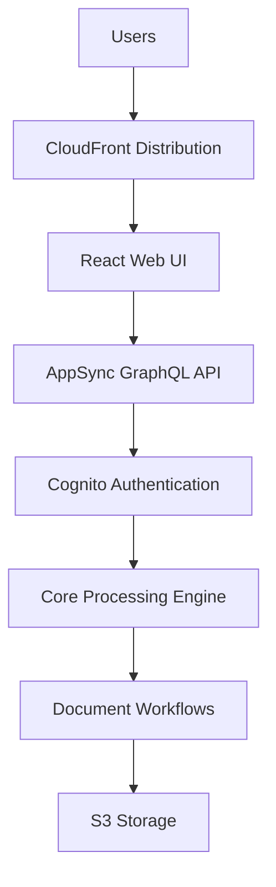
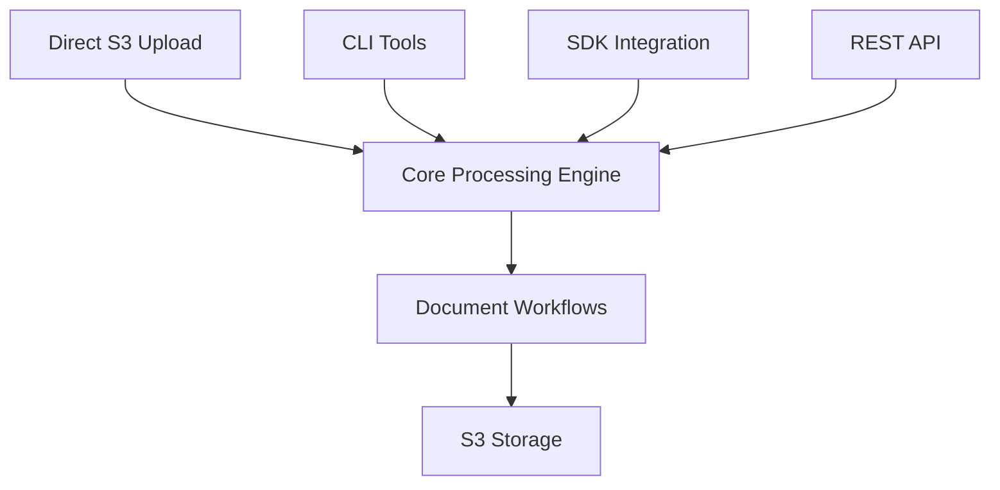

# GovCloud Architecture

This document describes the architectural differences between the standard (commercial AWS) and GovCloud deployments of the GenAI IDP Accelerator.

For deployment instructions, see [GovCloud Deployment Guide](./govcloud-deployment.md).

## Architecture Comparison

### Standard AWS Deployment

### GovCloud Deployment

## Services Removed in GovCloud

The following services are automatically removed from the GovCloud template:

### Web UI Components (11 resources removed)

- CloudFront distribution and origin access identity
- WebUI S3 bucket and build pipeline
- CodeBuild project for UI deployment
- Security headers policy

### API Layer (136 resources removed)

- AppSync GraphQL API and schema
- All GraphQL resolvers and data sources (50+ resolvers)
- Lambda resolver functions (20+ functions)
- **Test Studio Resources (36 resources)**: All test management Lambda functions, AppSync resolvers, data sources, SQS queues, and supporting infrastructure added in v0.4.6
- API authentication and authorization
- Chat infrastructure (ChatMessagesTable, ChatSessionsTable)
- Agent chat processors and resolvers

### Authentication (14 resources removed)

- Cognito User Pool and Identity Pool
- User pool client and domain
- Admin user and group management
- Email verification functions

### WAF Security (6 resources removed)

- WAF WebACL and IP sets
- IP set updater functions
- CloudFront protection rules

### Agent & Analytics Features (14 resources removed)

- AgentTable and agent job tracking
- Agent request handler and processor functions
- **MCP/AgentCore Gateway Resources (7 resources)**: MCP integration components that depend on Cognito authentication (AgentCoreAnalyticsLambdaFunction, AgentCoreGatewayManagerFunction, AgentCoreGatewayExecutionRole, AgentCoreGateway, ExternalAppClient, and log groups)
- External MCP agent credentials secret
- Knowledge base query functions
- Chat with document features
- Text-to-SQL query capabilities

### HITL Support (11 resources removed)

- SageMaker A2I Human-in-the-Loop
- Private workforce configuration
- Human review workflows
- A2I flow definition and human task UI
- Cognito client for A2I integration

## Core Services Retained

The following essential services remain available in all [deployment packages](./govcloud-deployment.md#deployment-packages):

### Document Processing

- ✅ Pattern 2 only (Textract + Bedrock) — Pattern 1 (BDA) and Pattern 3 (Textract + SageMaker + Bedrock) require services not available in GovCloud
- ✅ Complete 6-step pipeline (OCR, Classification, Extraction, Assessment, Summarization, Evaluation)
- ✅ Step Functions workflows
- ✅ Lambda function processing
- ✅ Custom prompt Lambda integration

### Storage & Data

- ✅ S3 buckets (Input, Output, Working, Configuration, Logging)
- ✅ DynamoDB tables (Tracking, Configuration, Concurrency)
- ✅ Data encryption with customer-managed KMS keys
- ✅ Lifecycle policies and data retention

### Monitoring & Operations

- ✅ CloudWatch dashboards and metrics
- ✅ CloudWatch alarms and SNS notifications
- ✅ Lambda function logging and tracing
- ✅ Step Functions execution logging

### Integration

- ✅ SQS queues for document processing
- ✅ EventBridge rules for workflow orchestration
- ✅ Post-processing Lambda hooks
- ✅ Evaluation and reporting systems

## Limitations and Workarounds

### ❌ Removed Features

- Web-based user interface
- Real-time document status updates via websockets
- Interactive configuration management
- User authentication and authorization via Cognito
- CloudFront content delivery and caching
- WAF security rules and IP filtering
- Analytics query interface
- Document knowledge base chat interface

### ✅ Available Workarounds

- Use S3 direct upload or [Batch Jobs REST API](./govcloud-batch-api.md) instead of web UI
- Monitor through CloudWatch instead of real-time UI (see [GovCloud Operations](./govcloud-operations.md))
- Edit configuration files in S3 directly
- Use CLI/SDK for authentication needs
- Access content directly from S3
- Implement custom security at application level
- Query data through Athena directly
- Use the lookup function for document queries

## Related Documentation

- [GovCloud Deployment Guide](./govcloud-deployment.md) — prerequisites, deployment packages, and deploy commands
- [Batch Jobs REST API](./govcloud-batch-api.md) — API reference, authentication, and bastion tunnel setup
- [GovCloud Operations](./govcloud-operations.md) — monitoring, troubleshooting, and best practices
