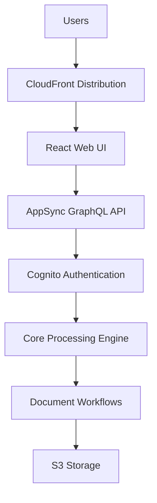
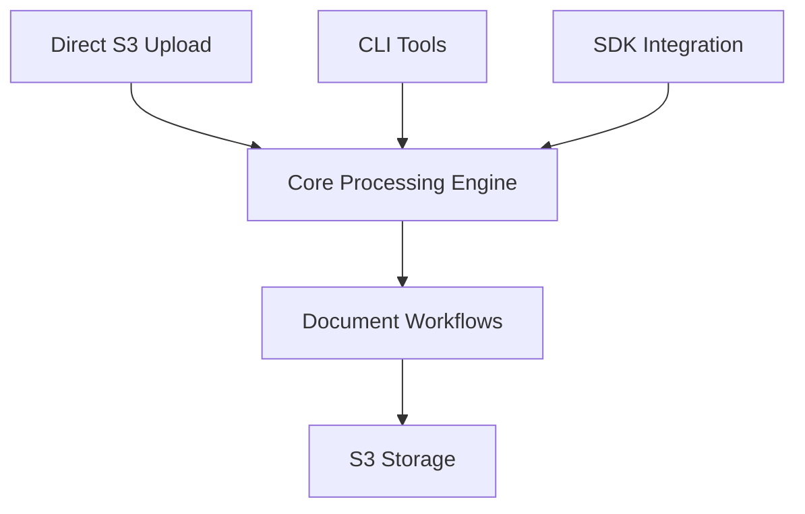

# GovCloud Deployment Guide

## Overview

The GenAI IDP Accelerator now supports "headless" deployment to AWS GovCloud regions through a specialized template generation script. This solution addresses two key GovCloud requirements:

1. **ARN Partition Compatibility**: All ARN references use `arn:${AWS::Partition}:` instead of `arn:aws:` to work in both commercial and GovCloud regions
2. **Service Compatibility**: Removes services not available in GovCloud (AppSync, CloudFront, WAF, Cognito UI components)

For details on what services are removed vs. retained, see [GovCloud Architecture](./govcloud-architecture.md).

## Deployment Packages

The GovCloud template supports four deployment configurations. Choose the one that matches your use case:

| | Vanilla | Headless API | Headless API + VPC Secured Mode | Headless API + VPC Secured Mode + Bastion |
|---|---|---|---|---|
| **Use Case** | Simplest deployment; manual document processing via S3 upload or IDP CLI | Programmatic API access; only headless resources in VPC | Production workloads with all compute in VPC for full network isolation | Development/testing with private API access from local machine via bastion tunnel |
| **Access Methods** | S3 direct upload, IDP CLI, SDK | All vanilla methods + REST API (`/jobs` endpoints) | Same as Headless API | All API methods + local access via SSM tunnel |
| **Networking** | No VPC required | Private API Gateway + headless Lambdas in VPC; core Lambdas outside VPC | All Lambda functions + Private API Gateway in VPC | Same as VPC Secured Mode, plus an EC2 bastion host for tunneling |
| **Authentication** | IAM only | Cognito client credentials (OAuth2 bearer tokens) | Same as Headless API | Same as Headless API |
| **Key Parameters** | None | Auto-set by `--headless` | Same as Headless API + `DeployInVPC=true` | Same as VPC Secured Mode + `DeployBastionHost=true` |
| **VPC Parameters** | None | `VpcId`, `PrivateSubnetIds`, `ApiGatewayVpcEndpointId`, `LambdaSecurityGroupId` | Same as Headless API | Same as Headless API |
| **Bastion Parameters** | None | None | None | `BastionHostSubnetId`, `BastionHostSecurityGroupId` |
| **When to Choose** | You have your own integration layer, or are evaluating the solution | You need API access but don't require full network isolation for core processing | You need API access with all compute isolated in your VPC | You need to call the API from your laptop during development |

### What Gets Deployed in Each Package

**Vanilla (all packages include this):**
- Core document processing engine (unified pattern with pipeline mode)
- Step Functions workflows
- S3 buckets, DynamoDB tables, SQS queues, EventBridge rules
- CloudWatch dashboards, alarms, SNS notifications
- KMS encryption keys

**Headless API adds:**
- Private API Gateway with `/jobs` endpoints (POST, GET)
- Cognito User Pool with machine-to-machine client credentials
- VPC-enabled Lambda functions for API handling and batch pre-processing

**VPC Secured Mode adds:**
- Deploys all core document processing Lambda functions into the VPC

**Bastion adds:**
- EC2 instance in a public subnet for SSM Session Manager tunneling
- No inbound security group rules required — access is via AWS SSM

## Architecture Differences

### Standard AWS Deployment



### GovCloud Deployment



## Deployment Process

### Dependencies

You need to have the following packages installed on your computer:

1. bash shell (Linux, MacOS, Windows-WSL)
2. aws (AWS CLI)
3. [sam (AWS SAM)](https://docs.aws.amazon.com/serverless-application-model/latest/developerguide/install-sam-cli.html)
4. python 3.12 (required to generate templates)
5. Node.js >=22.12.0
6. npm >=10.0.0
7. A local Docker daemon
8. Python packages for the IDP CLI and SDK. Run `make setup-venv` from the project root to create a `.venv` and install all required packages (idp-cli, idp-sdk, idp_common). Activate with `source .venv/bin/activate`.

### Deploy to GovCloud

Build and deploy to GovCloud with a single command. The `--from-code .` flag builds from your local source code (required for GovCloud since public templates are not published for GovCloud regions), and `--headless` strips UI, AppSync, Cognito, and WAF resources.

Choose the command that matches your desired [deployment package](#deployment-packages).

> **Note**: The CLI creates an S3 bucket automatically. Customize with `--bucket-basename` and `--prefix`.

> **Legacy**: The `scripts/generate_govcloud_template.py` script is deprecated. Use `idp-cli deploy --headless --from-code .` instead.

> **Note on `--headless`**: The CLI flag both strips UI/AppSync/Cognito/WAF resources from the template and automatically sets the `EnableHeadless=true` stack parameter (which enables the Jobs REST API). You do not need to pass `EnableHeadless=true` in `--parameters` — it's set for you.

#### Option A: Vanilla (no API, no VPC)

```bash
idp-cli deploy \
  --stack-name my-idp-headless-stack \
  --region us-gov-west-1 \
  --from-code . \
  --headless \
  --wait
```

With this deployment, interact with the system via:
- Direct S3 upload to the input bucket
- IDP CLI (`idp-cli`)
- SDK integration

#### Option B: Headless API

```bash
idp-cli deploy \
  --stack-name my-idp-headless-stack \
  --region us-gov-west-1 \
  --from-code . \
  --headless \
  --wait \
  --parameters "VpcId=vpc-xxxxxxxxx,PrivateSubnetIds=subnet-xxxxx,subnet-xxxxx,subnet-xxxxx,ApiGatewayVpcEndpointId=vpce-xxxxxxxxx,LambdaSecurityGroupId=sg-xxxxxxxxx,ApiStageName=beta"
```

This enables the `/jobs` REST API as a Private API Gateway accessible only from within your VPC. Core document processing Lambdas remain outside the VPC. See [Batch Jobs REST API](./govcloud-batch-api.md) for usage.

#### Option C: Headless API + VPC Secured Mode (full isolation)

Make sure that all prerequisites defined [here](./vpc-secured-mode.md) are met before deploying into a managed VPC.

```bash
idp-cli deploy \
  --stack-name my-idp-headless-stack \
  --region us-gov-west-1 \
  --from-code . \
  --headless \
  --wait \
  --parameters "DeployInVPC=true,VpcId=vpc-xxxxxxxxx,PrivateSubnetIds=subnet-xxxxx,subnet-xxxxx,subnet-xxxxx,ApiGatewayVpcEndpointId=vpce-xxxxxxxxx,LambdaSecurityGroupId=sg-xxxxxxxxx,ApiStageName=beta"
```

This deploys all Lambda functions (headless and core processing) into the VPC for full network isolation. See [Batch Jobs REST API](./govcloud-batch-api.md) for usage.

#### Option D: Headless API + VPC Secured Mode + Bastion (development)

Make sure that all prerequisites defined [here](./vpc-secured-mode.md) are met before deploying into a managed VPC.

```bash
idp-cli deploy \
  --stack-name my-idp-headless-stack \
  --region us-gov-west-1 \
  --from-code . \
  --headless \
  --wait \
  --parameters "DeployInVPC=true,VpcId=vpc-xxxxxxxxx,PrivateSubnetIds=subnet-xxxxx,subnet-xxxxx,subnet-xxxxx,ApiGatewayVpcEndpointId=vpce-xxxxxxxxx,LambdaSecurityGroupId=sg-xxxxxxxxx,ApiStageName=beta,DeployBastionHost=true,BastionHostSubnetId=subnet-xxxxxxxxx,BastionHostSecurityGroupId=sg-xxxxxxxxx"
```

This adds a bastion host for local API access via SSM tunnel. See [Private API Access via Bastion Tunnel](./govcloud-batch-api.md#private-api-access-via-bastion-tunnel) for setup.

> **Note on `--parameters` formatting**: Commas inside multi-value parameters (like `PrivateSubnetIds`) don't need escaping — the CLI parses `--parameters` by looking for the next `key=` pattern, so commas within values are preserved automatically.

## Services Removed in GovCloud

The following services are automatically removed from the GovCloud template:

### Web UI Components (11 resources removed)

- CloudFront distribution and origin access identity
- WebUI S3 bucket and build pipeline
- CodeBuild project for UI deployment
- Security headers policy

### API Layer (136 resources removed)

- AppSync GraphQL API and schema
- All GraphQL resolvers and data sources (50+ resolvers)
- Lambda resolver functions (20+ functions)
- **Test Studio Resources (36 resources)**: All test management Lambda functions, AppSync resolvers, data sources, SQS queues, and supporting infrastructure added in v0.4.6
- API authentication and authorization
- Chat infrastructure (ChatMessagesTable, ChatSessionsTable)
- Agent chat processors and resolvers

### Authentication (14 resources removed)

- Cognito User Pool and Identity Pool
- User pool client and domain
- Admin user and group management
- Email verification functions

### WAF Security (6 resources removed)

- WAF WebACL and IP sets
- IP set updater functions
- CloudFront protection rules

### Agent & Analytics Features (14 resources removed)

- AgentTable and agent job tracking
- Agent request handler and processor functions
- **MCP/AgentCore Gateway Resources (7 resources)**: MCP integration components that depend on Cognito authentication (AgentCoreAnalyticsLambdaFunction, AgentCoreGatewayManagerFunction, AgentCoreGatewayExecutionRole, AgentCoreGateway, ExternalAppClient, and log groups)
- External MCP agent credentials secret
- Knowledge base query functions
- Chat with document features
- Text-to-SQL query capabilities

### HITL Support (11 resources removed)

- SageMaker A2I Human-in-the-Loop
- Private workforce configuration
- Human review workflows
- A2I flow definition and human task UI
- Cognito client for A2I integration

## Core Services Retained

The following essential services remain available:

### Document Processing

- ✅ All 3 processing patterns (BDA, Textract+Bedrock, Textract+SageMaker+Bedrock)
- ✅ Complete 6-step pipeline (OCR, Classification, Extraction, Assessment, Summarization, Evaluation)
- ✅ Step Functions workflows
- ✅ Lambda function processing
- ✅ Custom prompt Lambda integration

### Storage & Data

- ✅ S3 buckets (Input, Output, Working, Configuration, Logging)
- ✅ DynamoDB tables (Tracking, Configuration, Concurrency)
- ✅ Data encryption with customer-managed KMS keys
- ✅ Lifecycle policies and data retention

### Monitoring & Operations

- ✅ CloudWatch dashboards and metrics
- ✅ CloudWatch alarms and SNS notifications
- ✅ Lambda function logging and tracing
- ✅ Step Functions execution logging

### Integration

- ✅ SQS queues for document processing
- ✅ EventBridge rules for workflow orchestration
- ✅ Post-processing Lambda hooks
- ✅ Evaluation and reporting systems

## Access Methods

Without the web UI, you can interact with the system through:

### 1. Direct S3 Upload

````bash
# Upload documents directly to input bucket
aws s3 cp my-document.pdf s3://InputBucket/my-document.pdf


### 2. Check progress
Using the lookup script
```bash
# Use the lookup script to check document status
./scripts/lookup_file_status.sh documents/my-document.pdf MyStack
````

Or navigate to the AWS Step Functions workflow using the link in the stack Outputs tab in CloudFormation, to visually monitor workflow progress.

## Monitoring & Troubleshooting

### CloudWatch Dashboards

Access monitoring through CloudWatch console:

- Navigate to CloudWatch → Dashboards
- Find dashboard: `{StackName}-{Region}`
- View processing metrics, error rates, and performance

### CloudWatch Logs

Monitor processing through log groups:

- `/aws/lambda/{StackName}-*` - Lambda function logs
- `/aws/vendedlogs/states/{StackName}/workflow` - Step Functions logs
- `/{StackName}/lambda/*` - Pattern-specific logs

### Alarms and Notifications

- SNS topic receives alerts for errors and performance issues
- Configure email subscriptions to the AlertsTopic

## Limitations in GovCloud Version

The following features are not available:

### ❌ Removed Features

- Web-based user interface
- Real-time document status updates via websockets
- Interactive configuration management
- User authentication and authorization via Cognito
- CloudFront content delivery and caching
- WAF security rules and IP filtering
- Analytics query interface
- Document knowledge base chat interface

### ✅ Available Workarounds

- Use S3 direct upload instead of web UI
- Monitor through CloudWatch instead of real-time UI
- Edit configuration files in S3 directly
- Use CLI/SDK for authentication needs
- Access content directly from S3
- Implement custom security at application level
- Query data through Athena directly
- Use the lookup function for document queries

## Best Practices

### Security

1. **IAM Roles**: Use least-privilege IAM roles
2. **Encryption**: Enable encryption at rest and in transit
3. **Network**: Deploy in private subnets if required
4. **Access Control**: Implement custom authentication as needed

### Operations

1. **Monitoring**: Set up CloudWatch alarms for critical metrics
2. **Logging**: Configure appropriate log retention policies
3. **Backup**: Implement backup strategies for important data
4. **Updates**: Plan for template updates and maintenance

### Performance

1. **Concurrency**: Adjust `MaxConcurrentWorkflows` based on load
2. **Timeouts**: Configure appropriate timeout values
3. **Memory**: Optimize Lambda memory settings
4. **Batching**: Use appropriate batch sizes for processing

## Troubleshooting

### Common Issues

**Missing Dependencies**

- Ensure all Bedrock models are enabled in the region.  GovCloud deployment uses amazon.nova-lite-v1:0, amazon.nova-pro-v1:0, us.anthropic.claude-3-5-sonnet-20240620-v1:0, and anthropic.claude-3-7-sonnet-20250219-v1:0 by default
- Verify IAM permissions for service roles
- Check S3 bucket policies and access

**Processing Failures**

- Check CloudWatch logs for detailed error messages
- Verify document formats are supported
- Confirm configuration settings are valid

### Support Resources

1. **AWS Documentation**: [GovCloud User Guide](https://docs.aws.amazon.com/govcloud-us/)
2. **Bedrock in GovCloud**: [Model Availability](https://docs.aws.amazon.com/bedrock/latest/userguide/models-regions.html)
3. **Service Limits**: [GovCloud Service Quotas](https://docs.aws.amazon.com/govcloud-us/latest/UserGuide/govcloud-limits.html)

## Migration from Commercial AWS

If migrating an existing deployment:

1. **Export Configuration**: Download all configuration from existing stack
2. **Export Data**: Copy any baseline or reference data
3. **Deploy GovCloud**: Use the generated template
4. **Import Configuration**: Upload configuration to new stack
5. **Validate**: Test processing with sample documents

## Cost Considerations

GovCloud pricing may differ from commercial regions:

- Review [GovCloud Pricing](https://aws.amazon.com/govcloud-us/pricing/)
- Update cost estimates in configuration files
- Monitor actual usage through billing dashboards

## Compliance Notes

- The GovCloud version maintains the same security features
- Data encryption and retention policies are preserved
- All processing remains within GovCloud boundaries
- No data egress to commercial AWS regions
