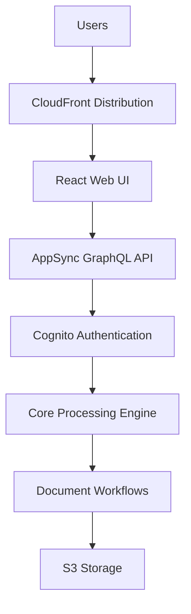
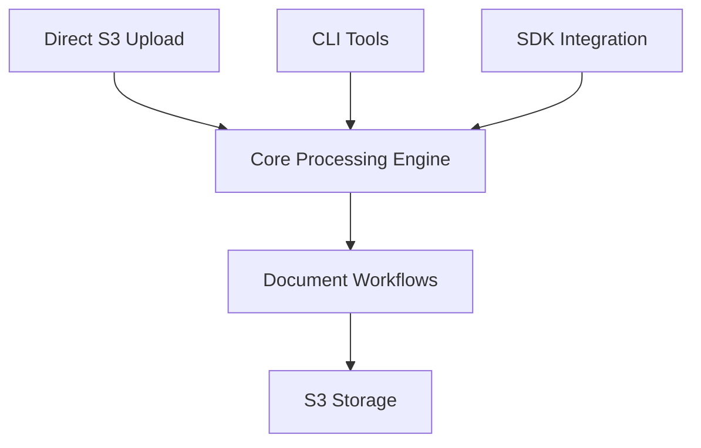

# GovCloud Deployment Guide

## Overview

The GenAI IDP Accelerator now supports "headless" deployment to AWS GovCloud regions through a specialized template generation script. This solution addresses two key GovCloud requirements:

1. **ARN Partition Compatibility**: All ARN references use `arn:${AWS::Partition}:` instead of `arn:aws:` to work in both commercial and GovCloud regions
2. **Service Compatibility**: Removes services not available in GovCloud (AppSync, CloudFront, WAF, Cognito UI components)

## Architecture Differences

### Standard AWS Deployment



### GovCloud Deployment



## Deployment Process

### Dependencies

You need to have the following packages installed on your computer:

1. bash shell (Linux, MacOS, Windows-WSL)
2. aws (AWS CLI)
3. [sam (AWS SAM)](https://docs.aws.amazon.com/serverless-application-model/latest/developerguide/install-sam-cli.html)
4. python 3.12 (required to generate templates)
5. Node.js >=22.12.0
6. npm >=10.0.0
7. A local Docker daemon
8. Python packages for publish.py.  You are encouraged to configure a virtual environment for dependency management, ie. `python -m venv .venv`.  Activate the environment (`. .venv/bin/activate`) and then install dependencies via `pip install boto3 rich PyYAML botocore setuptools docker ruff build`

### Step 1: Generate GovCloud Template

First, generate the GovCloud-compatible template - this run the standard build process first to create all Lambda functions and artifacts, and then creates a stripped down version for GovCloud:

```bash
# Note: The Python script will create an S3 bucket automatically by concatenating the provided bucket name and region, ie. my-govcloud-bucket-us-gov-west-1.  You can change the bucket base name as desired.  Files will be placed under [my-prefix] prefix within the generated bucket.
# Build for GovCloud region
python scripts/generate_govcloud_template.py my-bucket-govcloud my-prefix us-gov-west-1

# Or build for commercial region first (for testing)
python scripts/generate_govcloud_template.py my-bucket my-prefix us-east-1
```

### Step 2: Deploy to GovCloud

Deploy the generated template to GovCloud using the AWS CloudFormation console (recommended) or deploy using AWS CLI e.g:

```bash
# Populate {s3-bucket-govcloud} with the bucket name where you'd like the template to be uploaded
aws cloudformation deploy \
  --template-file .aws-sam/idp-govcloud.yaml \
  --s3-bucket <S3BUCKET> \
  --s3-prefix idp-headless \
  --stack-name my-idp-headless-stack \
  --region us-gov-west-1 \
  --capabilities CAPABILITY_NAMED_IAM CAPABILITY_AUTO_EXPAND \
  --parameter-overrides \
    IDPPattern="Pattern2 - Packet processing with Textract and Bedrock" \
  --s3-bucket {s3-bucket-govcloud}
```

### Optional: Deploy with REST API and Bastion Host

To enable the Batch Jobs REST API (`/jobs` endpoints) with local development access via a bastion host, add the following VPC and bastion parameters:

```bash
aws cloudformation deploy \
  --template-file .aws-sam/idp-govcloud.yaml \
  --stack-name my-idp-govcloud-stack \
  --region us-gov-west-1 \
  --s3-bucket {s3-bucket-govcloud} \
  --capabilities CAPABILITY_NAMED_IAM CAPABILITY_AUTO_EXPAND \
  --parameter-overrides \
    IDPPattern="Pattern2 - Packet processing with Textract and Bedrock" \
    VpcId=vpc-xxxxxxxxx \
    PrivateSubnetIds=subnet-xxxxx,subnet-xxxxx,subnet-xxxxx \
    ApiGatewayVpcEndpointId=vpce-xxxxxxxxx \
    LambdaSecurityGroupId=sg-xxxxxxxxx \
    ApiStageName=prod \
    DeployBastionHost=true \
    BastionHostSubnetId=subnet-xxxxxxxxx \
    BastionHostSecurityGroupId=sg-xxxxxxxxx
```

**VPC Parameters (required for REST API):**
- `VpcId` - VPC for Lambda functions
- `PrivateSubnetIds` - Comma-separated private subnet IDs (minimum 2 for HA)
- `ApiGatewayVpcEndpointId` - VPC endpoint for private API Gateway access
- `LambdaSecurityGroupId` - Security group for VPC-enabled Lambda functions
- `ApiStageName` - API Gateway deployment stage name (default: `prod`)

**Bastion Parameters (optional, for local development access):**
- `DeployBastionHost` - Set to `true` to deploy the bastion EC2 instance
- `BastionHostSubnetId` - A **public** subnet for the bastion host
- `BastionHostSecurityGroupId` - Security group for the bastion host (no special inbound rules required — the tunnel operates via AWS SSM Session Manager)

### Local API Access via Bastion Tunnel

After deploying with bastion enabled, you can access the private API Gateway from your local machine.

**Prerequisites:**
- AWS CLI configured with credentials for the target account
- [AWS Session Manager plugin](https://docs.aws.amazon.com/systems-manager/latest/userguide/session-manager-working-with-install-plugin.html) — required for the SSM-based SSH tunnel
- SSH client


**Step 1: Start the tunnel**

```bash
./scripts/bastion.sh <STACK_NAME>
```

**Step 2: Generate a bearer token**

In a separate terminal, generate an OAuth token for API authentication:

```bash
# Print token to stdout
./scripts/get_api_token.sh <STACK_NAME>

# Copy to clipboard (macOS)
./scripts/get_api_token.sh <STACK_NAME> | pbcopy
```

The token is a Cognito client credentials grant with `idp-api/jobs.read` and `idp-api/jobs.write` scopes.

**Step 3: Invoke the API**

Using curl:

```bash
curl -s ${API_GATEWAY_ENDPOINT}/jobs \
  -H "Authorization: Bearer $(./scripts/get_api_token.sh <STACK_NAME>)"
```

The `API_GATEWAY_ENDPOINT` is the `ApiGatewayEndpoint` value from your CloudFormation stack outputs, in the format `https://{restapi-id}.execute-api.{region}.amazonaws.com/{stage}`.

## Services Removed in GovCloud

The following services are automatically removed from the GovCloud template:

### Web UI Components (11 resources removed)

- CloudFront distribution and origin access identity
- WebUI S3 bucket and build pipeline
- CodeBuild project for UI deployment
- Security headers policy

### API Layer (136 resources removed)

- AppSync GraphQL API and schema
- All GraphQL resolvers and data sources (50+ resolvers)
- Lambda resolver functions (20+ functions)
- **Test Studio Resources (36 resources)**: All test management Lambda functions, AppSync resolvers, data sources, SQS queues, and supporting infrastructure added in v0.4.6
- API authentication and authorization
- Chat infrastructure (ChatMessagesTable, ChatSessionsTable)
- Agent chat processors and resolvers

### Authentication (14 resources removed)

- Cognito User Pool and Identity Pool
- User pool client and domain
- Admin user and group management
- Email verification functions

### WAF Security (6 resources removed)

- WAF WebACL and IP sets
- IP set updater functions
- CloudFront protection rules

### Agent & Analytics Features (14 resources removed)

- AgentTable and agent job tracking
- Agent request handler and processor functions
- **MCP/AgentCore Gateway Resources (7 resources)**: MCP integration components that depend on Cognito authentication (AgentCoreAnalyticsLambdaFunction, AgentCoreGatewayManagerFunction, AgentCoreGatewayExecutionRole, AgentCoreGateway, ExternalAppClient, and log groups)
- External MCP agent credentials secret
- Knowledge base query functions
- Chat with document features
- Text-to-SQL query capabilities

### HITL Support (11 resources removed)

- SageMaker A2I Human-in-the-Loop
- Private workforce configuration
- Human review workflows
- A2I flow definition and human task UI
- Cognito client for A2I integration

## Core Services Retained

The following essential services remain available:

### Document Processing

- ✅ All 3 processing patterns (BDA, Textract+Bedrock, Textract+SageMaker+Bedrock)
- ✅ Complete 6-step pipeline (OCR, Classification, Extraction, Assessment, Summarization, Evaluation)
- ✅ Step Functions workflows
- ✅ Lambda function processing
- ✅ Custom prompt Lambda integration

### Storage & Data

- ✅ S3 buckets (Input, Output, Working, Configuration, Logging)
- ✅ DynamoDB tables (Tracking, Configuration, Concurrency)
- ✅ Data encryption with customer-managed KMS keys
- ✅ Lifecycle policies and data retention

### Monitoring & Operations

- ✅ CloudWatch dashboards and metrics
- ✅ CloudWatch alarms and SNS notifications
- ✅ Lambda function logging and tracing
- ✅ Step Functions execution logging

### Integration

- ✅ SQS queues for document processing
- ✅ EventBridge rules for workflow orchestration
- ✅ Post-processing Lambda hooks
- ✅ Evaluation and reporting systems

## Access Methods

Without the web UI, you can interact with the system through:

### 1. Direct S3 Upload

````bash
# Upload documents directly to input bucket
aws s3 cp my-document.pdf s3://InputBucket/my-document.pdf
````

Monitor progress using the lookup script:
```bash
./scripts/lookup_file_status.sh documents/my-document.pdf MyStack
```

Or navigate to the AWS Step Functions workflow using the link in the stack Outputs tab in CloudFormation, to visually monitor workflow progress.

### 2. Batch Jobs REST API (requires VPC parameters)

Requires a bearer token for authentication. See [Local API Access via Bastion Tunnel](#local-api-access-via-bastion-tunnel) for setup, or generate a token directly:

```bash
# Generate a bearer token
TOKEN=$(./scripts/get_api_token.sh <STACK_NAME>)

# API_GATEWAY_ENDPOINT is the ApiGatewayEndpoint value from CloudFormation stack outputs
# Format: https://{api-id}.execute-api.{region}.amazonaws.com/{stage}

# Create a job and get presigned upload URL
curl -X POST ${API_GATEWAY_ENDPOINT}/jobs \
  -H "Authorization: Bearer $TOKEN" \
  -H "Content-Type: application/json" \
  -d '{"fileName": "documents.zip"}'

# Upload ZIP using the presigned URL and requiredHeaders from the response
curl -X POST "<uploadUrl from response>" \
  -F "Content-Type=<Content-Type from requiredHeaders>" \
  -F "key=<key from requiredHeaders>" \
  -F "x-amz-algorithm=<x-amz-algorithm from requiredHeaders>" \
  -F "x-amz-credential=<x-amz-credential from requiredHeaders>" \
  -F "x-amz-date=<x-amz-date from requiredHeaders>" \
  -F "x-amz-security-token=<x-amz-security-token from requiredHeaders>" \
  -F "policy=<policy from requiredHeaders>" \
  -F "x-amz-signature=<x-amz-signature from requiredHeaders>" \
  -F "file=@documents.zip"

# Check job status
curl ${API_GATEWAY_ENDPOINT}/jobs/{job_id} \
  -H "Authorization: Bearer $TOKEN"
```

**POST /jobs response:**

```json
{
  "jobId": "a1b2c3d4-e5f6-7890-abcd-ef1234567890",
  "upload": {
    "uploadUrl": "https://input-bucket.s3.amazonaws.com",
    "expiresInSeconds": 3600,
    "requiredHeaders": {
      "key": "jobs/a1b2c3d4-e5f6-7890-abcd-ef1234567890/archive.zip",
      "Content-Type": "application/zip",
      "x-amz-credential": "...",
      "x-amz-date": "...",
      "x-amz-security-token": "...",
      "x-amz-algorithm": "...",
      "policy": "...",
      "x-amz-signature": "..."
    }
  }
}
```

**GET /jobs/{job_id} response (in progress):**

```json
{
  "jobId": "a1b2c3d4-e5f6-7890-abcd-ef1234567890",
  "status": "IN_PROGRESS",
  "timestamps": {
    "createdAt": "2026-01-23T10:00:00Z",
    "updatedAt": "2026-01-23T10:05:00Z"
  },
  "files": {
    "document_a.pdf": "COMPLETED",
    "document_b.pdf": "IN_PROGRESS"
  }
}
```

**GET /jobs/{job_id} response (succeeded):**

```json
{
  "jobId": "a1b2c3d4-e5f6-7890-abcd-ef1234567890",
  "status": "SUCCEEDED",
  "timestamps": {
    "createdAt": "2026-01-23T10:00:00Z",
    "updatedAt": "2026-01-23T10:10:00Z"
  },
  "files": {
    "document_a.pdf": "COMPLETED",
    "document_b.pdf": "COMPLETED"
  },
  "result": {
    "downloadUrl": "https://output-bucket.s3.amazonaws.com/jobs/.../results.zip?...",
    "expiresInSeconds": 3600
  }
}
```

**GET /jobs/{job_id} response (partially succeeded):**

```json
{
  "jobId": "a1b2c3d4-e5f6-7890-abcd-ef1234567890",
  "status": "PARTIALLY_SUCCEEDED",
  "timestamps": {
    "createdAt": "2026-01-23T10:00:00Z",
    "updatedAt": "2026-01-23T10:10:00Z"
  },
  "files": {
    "document_a.pdf": "COMPLETED",
    "document_b.pdf": "FAILED"
  },
  "result": {
    "downloadUrl": "https://output-bucket.s3.amazonaws.com/jobs/.../results.zip?...",
    "expiresInSeconds": 3600
  }
}
```

> **Note:** The `{stage}` defaults to `prod` unless overridden via the `ApiStageName` parameter.

**Job Status Values:**
- `PENDING_UPLOAD` - Job created, awaiting ZIP upload
- `IN_PROGRESS` - Files being processed
- `SUCCEEDED` - All files completed
- `PARTIALLY_SUCCEEDED` - Some files completed, some failed/aborted. The results.zip file for these jobs will not include output data from the documents that did not complete processing
- `ABORTED` - All files aborted
- `FAILED` - All files failed

## Monitoring & Troubleshooting

### CloudWatch Dashboards

Access monitoring through CloudWatch console:

- Navigate to CloudWatch → Dashboards
- Find dashboard: `{StackName}-{Region}`
- View processing metrics, error rates, and performance

### CloudWatch Logs

Monitor processing through log groups:

- `/aws/lambda/{StackName}-*` - Lambda function logs
- `/aws/vendedlogs/states/{StackName}/workflow` - Step Functions logs
- `/{StackName}/lambda/*` - Pattern-specific logs

### Alarms and Notifications

- SNS topic receives alerts for errors and performance issues
- Configure email subscriptions to the AlertsTopic

## Limitations in GovCloud Version

The following features are not available:

### ❌ Removed Features

- Web-based user interface
- Real-time document status updates via websockets
- Interactive configuration management
- User authentication and authorization via Cognito
- CloudFront content delivery and caching
- WAF security rules and IP filtering
- Analytics query interface
- Document knowledge base chat interface

### ✅ Available Workarounds

- Use S3 direct upload instead of web UI
- Monitor through CloudWatch instead of real-time UI
- Edit configuration files in S3 directly
- Use CLI/SDK for authentication needs
- Access content directly from S3
- Implement custom security at application level
- Query data through Athena directly
- Use the lookup function for document queries

## Best Practices

### Security

1. **IAM Roles**: Use least-privilege IAM roles
2. **Encryption**: Enable encryption at rest and in transit
3. **Network**: Deploy in private subnets if required
4. **Access Control**: Implement custom authentication as needed

### Operations

1. **Monitoring**: Set up CloudWatch alarms for critical metrics
2. **Logging**: Configure appropriate log retention policies
3. **Backup**: Implement backup strategies for important data
4. **Updates**: Plan for template updates and maintenance

### Performance

1. **Concurrency**: Adjust `MaxConcurrentWorkflows` based on load
2. **Timeouts**: Configure appropriate timeout values
3. **Memory**: Optimize Lambda memory settings
4. **Batching**: Use appropriate batch sizes for processing

## Troubleshooting

### Common Issues

**Missing Dependencies**

- Ensure all Bedrock models are enabled in the region.  GovCloud deployment uses amazon.nova-lite-v1:0, amazon.nova-pro-v1:0, us.anthropic.claude-3-5-sonnet-20240620-v1:0, and anthropic.claude-3-7-sonnet-20250219-v1:0 by default
- Verify IAM permissions for service roles
- Check S3 bucket policies and access

**Processing Failures**

- Check CloudWatch logs for detailed error messages
- Verify document formats are supported
- Confirm configuration settings are valid

### Support Resources

1. **AWS Documentation**: [GovCloud User Guide](https://docs.aws.amazon.com/govcloud-us/)
2. **Bedrock in GovCloud**: [Model Availability](https://docs.aws.amazon.com/bedrock/latest/userguide/models-regions.html)
3. **Service Limits**: [GovCloud Service Quotas](https://docs.aws.amazon.com/govcloud-us/latest/UserGuide/govcloud-limits.html)

## Migration from Commercial AWS

If migrating an existing deployment:

1. **Export Configuration**: Download all configuration from existing stack
2. **Export Data**: Copy any baseline or reference data
3. **Deploy GovCloud**: Use the generated template
4. **Import Configuration**: Upload configuration to new stack
5. **Validate**: Test processing with sample documents

## Cost Considerations

GovCloud pricing may differ from commercial regions:

- Review [GovCloud Pricing](https://aws.amazon.com/govcloud-us/pricing/)
- Update cost estimates in configuration files
- Monitor actual usage through billing dashboards

## Compliance Notes

- The GovCloud version maintains the same security features
- Data encryption and retention policies are preserved
- All processing remains within GovCloud boundaries
- No data egress to commercial AWS regions
