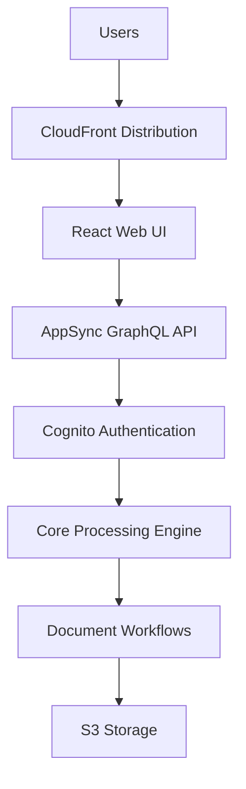
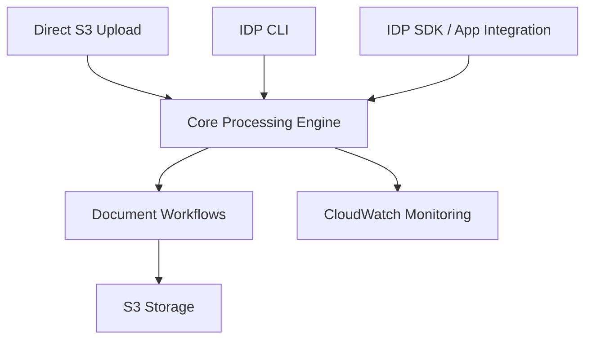

Copyright Amazon.com, Inc. or its affiliates. All Rights Reserved.
SPDX-License-Identifier: MIT-0

# Headless Deployment Guide

## Overview

A **headless** deployment of the GenAI IDP Accelerator deploys the full document-processing backend — OCR, classification, extraction, assessment, summarization, Step Functions workflows, storage, monitoring — **without** the browser-based UI and its supporting services. It is a first-class deployment mode supported by `idp-cli`, the `idp-sdk`, and the underlying CloudFormation template transformation.

Headless is **not specific to GovCloud**. It is available in **any supported region**, both **Commercial** and **GovCloud**, whenever the web UI is not needed or not permitted:

- **API-only / pipeline integrations** — you drive IDP from `idp-cli`, the `idp-sdk`, another application, or direct S3 uploads and don't need the Web UI.
- **Policy / compliance constraints** — your environment restricts services the UI depends on (Cognito, CloudFront, AppSync, or WAF WebACL for CloudFront).
- **Cost optimization** — remove UI-adjacent resources when they won't be used.
- **GovCloud** — headless is **required** in AWS GovCloud regions (`us-gov-*`) because the UI-layer services (CloudFront, AppSync, Cognito, WAF for CloudFront) are not available there. See also [GovCloud Deployment](./govcloud-deployment.md) for GovCloud-specific considerations.

> **If you want the Web UI but cannot use CloudFront** (for example, private-network / VPC-only requirements in a Commercial region), use [ALB Hosting](./alb-hosting.md) instead — ALB hosting keeps the full UI while serving it from within a VPC.

## What Gets Removed in Headless Mode

The headless transformation strips the following resource groups from the template:

### Web UI Components

- CloudFront distribution and origin access identity
- WebUI S3 bucket and build pipeline
- CodeBuild project for UI deployment
- Security headers policy

### API Layer

- AppSync GraphQL API and schema
- All GraphQL resolvers and data sources
- Lambda resolver functions
- Test Studio resources (Lambda functions, resolvers, data sources, SQS queues)
- Chat infrastructure (ChatMessagesTable, ChatSessionsTable)
- Agent chat processors and resolvers

### Authentication

- Cognito User Pool and Identity Pool
- User pool client and domain
- Admin user and group management
- Email verification functions

### WAF Security (CloudFront-facing)

- WAF WebACL and IP sets
- IP set updater functions
- CloudFront protection rules

### Agent & Analytics Features

- AgentTable and agent job tracking
- Agent request handler and processor functions
- MCP / AgentCore Gateway resources (AgentCoreAnalyticsLambdaFunction, AgentCoreGatewayManagerFunction, etc.)
- External MCP agent credentials secret
- Knowledge-base query functions
- Chat-with-document features
- Text-to-SQL query capabilities

### HITL (Human-in-the-Loop) Support

- SageMaker A2I Human-in-the-Loop
- Private workforce configuration
- Human-review workflows
- A2I flow definition and human task UI
- Cognito client for A2I integration

### Discovery (Web-UI-dependent)

- BlueprintOptimization, MultiDocDiscovery, and DiscoveryProcessor resources that depend on AppSync / GraphQL

## What Is Retained

All core document-processing functionality is retained:

### Document Processing

- ✅ All processing patterns (BDA, Textract+Bedrock, Textract+SageMaker+Bedrock)
- ✅ Complete pipeline (OCR, Classification, Extraction, Assessment, Summarization, Evaluation)
- ✅ Step Functions workflows and Lambda processing
- ✅ Custom prompt Lambda integration

### Storage & Data

- ✅ S3 buckets (Input, Output, Working, Configuration, Logging)
- ✅ DynamoDB tables (Tracking, Configuration, Concurrency)
- ✅ Data encryption with customer-managed KMS keys
- ✅ Lifecycle policies and data retention

### Monitoring & Operations

- ✅ CloudWatch dashboards and metrics
- ✅ CloudWatch alarms and SNS notifications
- ✅ Lambda function logging and tracing
- ✅ Step Functions execution logging

### Integration

- ✅ SQS queues for document processing
- ✅ EventBridge rules for workflow orchestration
- ✅ Post-processing Lambda hooks
- ✅ Evaluation and reporting systems

## Architecture

### Standard (with Web UI) Deployment



### Headless Deployment



## Deploying a Headless Stack

Headless deployment is available through [`idp-cli`](./idp-cli.md) and the [`idp-sdk`](./idp-sdk.md). Two paths are supported:

1. **Pre-built published template** (Commercial regions only) — the CLI downloads the published `idp-main.yaml`, transforms it to headless in-place, uploads it to a temporary S3 location in your account, and deploys. No local build required.
2. **Build from source** (`--from-code .`) — required for **GovCloud** (templates are not published for GovCloud regions), and useful for development / testing in any region.

### Prerequisites

- AWS CLI with credentials for the target account/region
- Python 3.12+ with the IDP CLI installed (`make setup-venv && source .venv/bin/activate`)
- For `--from-code` builds only: AWS SAM CLI, Docker, Node.js >= 22.12, npm >= 10

### Deploy in a Commercial Region (no local build)

Fastest path. Uses the pre-published template, transforms it to headless, and deploys:

```bash
idp-cli deploy \
  --stack-name my-idp-headless \
  --region us-east-1 \
  --admin-email user@example.com \
  --headless \
  --wait
```

> **Note**: In headless mode, `--admin-email` is still accepted but has no effect — no Cognito user pool is created.

### Deploy in a Commercial Region from Local Source

Use this for development iterations or to deploy a customized build:

```bash
idp-cli deploy \
  --stack-name my-idp-headless-dev \
  --region us-east-1 \
  --from-code . \
  --headless \
  --wait
```

### Deploy to GovCloud (always headless, always from source)

GovCloud **must** use `--headless` (UI services are unavailable) and **must** use `--from-code` (no public GovCloud templates are published). The CLI auto-detects GovCloud regions (`us-gov-*`) and applies the GovCloud configuration defaults (ARN partition fixes, GovCloud-compatible Bedrock models, GovCloud configuration presets):

```bash
idp-cli deploy \
  --stack-name my-idp-headless \
  --region us-gov-west-1 \
  --from-code . \
  --headless \
  --wait
```

See [GovCloud Deployment](./govcloud-deployment.md) for GovCloud-specific requirements (supported Bedrock models, ARN partition, pricing, compliance notes).

### Publish a Headless Template Separately

If you want to publish the headless template to S3 but deploy later (or share it with others), use `idp-cli publish --headless`:

```bash
idp-cli publish \
  --source-dir . \
  --region us-east-1 \
  --headless
```

This builds both the standard and the headless template variants, uploads both to S3, and prints deployment URLs and 1-click launch links for each.

### Deploy Programmatically via the SDK

The `idp-sdk` exposes the same capability through the `publish` namespace:

```python
from idp_sdk import IDPClient

client = IDPClient(region="us-east-1")

# Option A: Build both standard and headless variants
result = client.publish.build(
    source_dir=".",
    region="us-east-1",
    headless=True,
)
print("Headless template URL:", result.headless_template_url)

# Option B: Transform an existing (already-built) template to headless
transform_result = client.publish.transform_template_headless(
    source_template="./.aws-sam/idp-main.yaml",
    output_path="./.aws-sam/idp-headless.yaml",
    update_govcloud_config=False,   # set True for GovCloud defaults
)
print("Headless template written to:", transform_result.output_path)
```

See [IDP SDK — Publish Operations](./idp-sdk.md#publish-operations) for full parameter and return-type details.

## Access Methods (No Web UI)

Without the Web UI, interact with the system through one of:

### 1. Direct S3 Upload

```bash
# Upload documents directly to the Input bucket (from stack outputs)
aws s3 cp my-document.pdf s3://<InputBucket>/my-document.pdf
```

### 2. IDP CLI

```bash
# Process a local directory and monitor progress
idp-cli process \
  --stack-name my-idp-headless \
  --dir ./documents/ \
  --monitor

# Download extraction results
idp-cli download-results \
  --stack-name my-idp-headless \
  --batch-id <batch-id> \
  --output-dir ./results/
```

See [IDP CLI documentation](./idp-cli.md) for the full command reference.

### 3. IDP SDK (Python)

```python
from idp_sdk import IDPClient

client = IDPClient(stack_name="my-idp-headless", region="us-east-1")

# Submit a document for processing
doc = client.document.process(file_path="./invoice.pdf")

# Download extraction results when complete
client.document.download_results(
    document_id=doc.document_id,
    output_dir="./results/",
)
```

See [IDP SDK documentation](./idp-sdk.md) for the full API reference.

### 4. Check Progress

Use the CLI `status` command, the SDK `document.get_status()` / `batch.get_status()` methods, or navigate to the AWS Step Functions console via the link in the stack's CloudFormation Outputs tab.

## Features Not Available in Headless Mode

The following features depend on the UI/AppSync/Cognito stack and are therefore **not available** in a headless deployment:

- Web-based user interface (document upload, viewer, dashboards)
- Real-time document status updates via WebSockets
- Interactive configuration management via the UI
- Cognito-backed user authentication and RBAC
- CloudFront content delivery
- WAF security rules and IP filtering (for CloudFront)
- Agent Companion Chat (conversational UI)
- Agent Analytics (natural-language analytics UI)
- Document knowledge-base chat interface
- Test Studio (UI-driven test management)
- Human-in-the-Loop review UI (A2I)

### Workarounds

| Capability | Headless alternative |
|---|---|
| Document upload | S3 direct upload, `idp-cli process`, `client.document.process()` |
| Status monitoring | `idp-cli status`, `client.document.get_status()`, Step Functions console, CloudWatch dashboards |
| Configuration management | Edit the configuration YAML and upload via `idp-cli config-upload` / `client.config.upload()` |
| Extraction results | `idp-cli download-results`, `client.document.download_results()`, read directly from the Output bucket |
| Evaluation / metrics | Athena queries on the reporting database, `idp-cli test-result` / `test-compare`, reporting S3 outputs |
| Authentication / RBAC | Implement at the application / network layer (IAM, API Gateway authorizers, VPC, SSO) |

## When to Choose Headless vs. Standard vs. ALB Hosting

| Requirement | Recommended mode |
|---|---|
| You want the full Web UI, deployed with defaults | **Standard** (CloudFront + CloudFormation) |
| You want the full Web UI but cannot use CloudFront (private network / VPC-only) | **[ALB Hosting](./alb-hosting.md)** |
| You only need the backend (API / pipeline), no UI | **Headless** (this guide) |
| Deploying to AWS **GovCloud** | **Headless** (required) + see [GovCloud Deployment](./govcloud-deployment.md) |
| Organization prohibits CloudFront / Cognito / AppSync / WAF | **Headless** |

## Best Practices

### Security

1. **IAM**: Use least-privilege IAM roles for any application / CI/CD credentials that interact with the stack.
2. **Encryption**: Customer-managed KMS keys are enabled by default — keep them.
3. **Network**: If required, deploy Lambda functions and other services in private subnets (see [Deployment in Private Network](./deployment-private-network.md)).
4. **Access control**: Implement authentication and authorization at your application or network layer (IAM, VPC, SSO, API Gateway) since Cognito is not deployed.

### Operations

1. **Monitoring**: CloudWatch dashboards, alarms, and SNS alerts are still deployed — subscribe your ops email to the AlertsTopic.
2. **Logging**: Configure appropriate log-retention policies for CloudWatch log groups.
3. **Capacity**: Tune `MaxConcurrentWorkflows`, Lambda memory, and Bedrock throughput the same way as a standard deployment. See [Capacity Planning](./capacity-planning.md).
4. **Updates**: Re-run `idp-cli deploy --headless` (optionally with `--from-code .`) to apply template or code changes.

## Troubleshooting

- **"Region '…' is not supported for headless mode"** — When you use `--headless` without `--from-code` in a region that has no pre-published `idp-main.yaml`. Options: (a) use a supported region, (b) use `--from-code .`, or (c) supply `--template-url` explicitly.
- **CloudFormation `AllowedValues` / `GraphQLApi.Arn` errors on headless stacks** — Ensure you are using a recent version of the CLI; earlier builds had issues that have been fixed (see CHANGELOG for `lending-package-sample-govcloud` ConfigurationMap and Discovery-resource removals).
- **GovCloud model access** — Confirm Bedrock model access is enabled for the models listed in [GovCloud Deployment](./govcloud-deployment.md).

## Related Documentation

- [IDP CLI](./idp-cli.md) — `deploy --headless`, `publish --headless`
- [IDP SDK](./idp-sdk.md) — `publish.build()`, `publish.transform_template_headless()`
- [GovCloud Deployment](./govcloud-deployment.md) — GovCloud-specific requirements and defaults
- [ALB Hosting](./alb-hosting.md) — Deploying the Web UI inside a VPC (alternative to headless when you still want the UI)
- [Deployment in Private Network](./deployment-private-network.md) — Private-network deployment guidance
- [Deployment Guide](./deployment.md) — General build / publish / deploy reference
