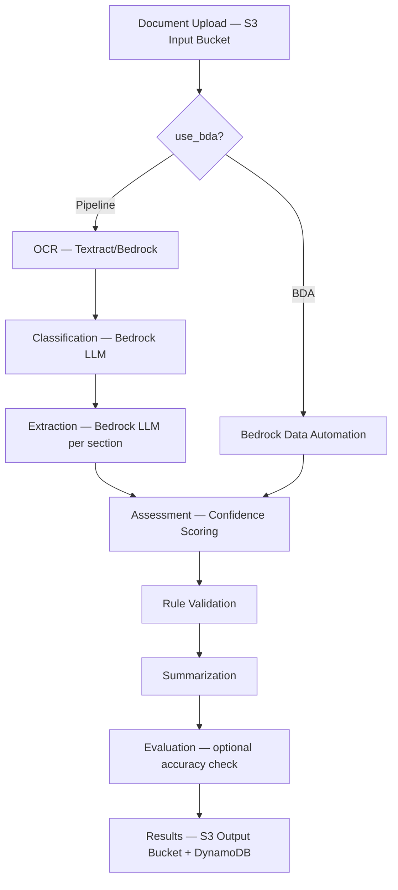

# GenAI IDP Accelerator — Project Brief

## Overview

The **GenAI Intelligent Document Processing (GenAI IDP) Accelerator** is a scalable, serverless AWS solution for automated document processing and information extraction. It combines OCR capabilities with generative AI to convert unstructured documents into structured data at scale.

- **Current Version**: 0.5.4.dev1
- **License**: MIT-0
- **Runtime**: Python 3.12+, Node.js (UI)
- **Repository**: `aws-solutions-library-samples/accelerated-intelligent-document-processing-on-aws`
- **Alternative implementations**: Also available as [AWS CDK constructs](https://github.com/cdklabs/genai-idp) and [Terraform module](https://github.com/awslabs/genai-idp-terraform)

## Architecture

### Unified Pattern (since v0.5.0)

A single CloudFormation deployment supports two processing modes, controlled by the `use_bda` configuration flag:

- **Pipeline mode** (default): OCR → Bedrock Classification → Bedrock Extraction → Assessment → Rule Validation → Summarization
- **BDA mode**: End-to-end processing with Bedrock Data Automation (BDA) → Rule Validation → Summarization

Both modes share common infrastructure for queueing (SQS), tracking (DynamoDB), monitoring (CloudWatch), and evaluation.



### Infrastructure Stack

- **12 Lambda functions** (BDA branch + Pipeline branch + shared tail)
- **Nested CloudFormation stacks**: `patterns/unified/`, `nested/appsync/`, `nested/alb-hosting/`, `nested/bedrockkb/`, `nested/bda-lending-project/`
- **Main template**: `template.yaml` → delegates to pattern and nested stacks
- **Docker-based Lambda deployment** (10 GB image limit vs 250 MB zip)
- **DynamoDB**: Tracking table (documents, test runs, test sets), Configuration table, Users table
- **S3 buckets**: Input, Output, Evaluation Baseline, Reporting, Configuration Library
- **AppSync GraphQL API** with Cognito authentication and WAF protection
- **Step Functions** state machine orchestrating the processing pipeline
- **CloudFront** (default) or **ALB** (VPC-based) for Web UI hosting

## Core Processing Pipeline

The 6-step modular pipeline enriches a central `Document` object at each stage:

```
Step 0: Setup → Step 1: OCR → Step 2: Classification → Step 3: Extraction → Step 4: Assessment → Step 5: Summarization → Step 6: Evaluation
```

Each step can be enabled/disabled via configuration. Assessment, summarization, evaluation, and rule validation are all config-driven toggles.

## Key Packages

### `lib/idp_common_pkg/` — Core Library (`idp_common`)

The shared Python library powering all Lambda functions and notebooks:

```
idp_common/
├── models.py                  # Document, Page, Section, Status data classes
├── docs_service.py            # DynamoDB document operations
├── delete_documents.py        # Document deletion logic
├── agents/                    # Agent framework (Analytics, Error Analyzer, Code Intelligence)
├── appsync/                   # AppSync client and mutations
├── assessment/                # Confidence evaluation (standard + granular)
├── bda/                       # Bedrock Data Automation integration
├── bedrock/                   # LLM client with prompt caching, retry, metering
├── classification/            # Document classification (holistic, page-level, regex)
├── config/                    # Configuration management with system defaults
├── discovery/                 # Automated schema discovery from samples
├── dynamodb/                  # DynamoDB utilities
├── evaluation/                # Stickler-based accuracy evaluation framework
├── extraction/                # Structured extraction (standard + agentic)
├── image/                     # Image processing and resizing
├── metrics/                   # Performance tracking
├── model_finetuning/          # Nova model fine-tuning workflows
├── ocr/                       # Textract + Bedrock OCR backends
├── reporting/                 # Parquet reporting for Athena analytics
├── rule_validation/           # Business rule compliance checking
├── s3/                        # S3 operations and utilities
├── schema/                    # JSON Schema handling and conversion
├── summarization/             # Document summarization
└── utils/                     # Common utilities
```

### `lib/idp_sdk/` — Python SDK (`idp_sdk`)

Programmatic interface with 11 operation namespaces:

```python
from idp_sdk import IDPClient
client = IDPClient(stack_name="IDP")

# Namespaces: stack, batch, document, config, discovery, manifest, testing, search, evaluation, assessment, publish
client.batch.process(dir="./samples/", monitor=True)
client.config.list()
client.discovery.run(document_path="sample.pdf")
client.publish.build(source_dir=".")
```

- `IDPPublisher` class in `idp_sdk._core.publish`
- `HeadlessTemplateTransformer` in `idp_sdk._core.template_transform`
- Pydantic return models for all operations

### `lib/idp_cli_pkg/` — Command Line Interface (`idp-cli`)

Full CLI for batch processing, deployment, evaluation, and management:

```bash
idp-cli process --stack-name IDP --dir ./samples/ --monitor
idp-cli deploy --stack-name IDP --from-code --headless
idp-cli publish --region us-east-1 --headless
idp-cli discover --stack-name IDP --document sample.pdf --auto-detect
idp-cli test-run --stack-name IDP --test-set my-tests
```

### `lib/idp_mcp_connector_pkg/` — MCP Connector

Bridges coding assistants (Cline, Kiro) to the IDP MCP Server with automatic Cognito authentication and dynamic tool discovery.

## Web UI (`src/ui/`)

React/TypeScript frontend with AWS CloudScape Design System:

- **Document List** — paginated, real-time updates via subscriptions, date range filtering
- **Document Details** — processing flow visualization, visual editor with bounding boxes, section editing
- **Configuration** — JSON Schema-based document class editor, model selection, prompt editing
- **Configuration Versions** — named snapshots, compare, import/export, activate
- **Discovery** — automated schema generation from sample documents
- **Test Studio** — test set management, test execution, result comparison
- **Agent Companion Chat** — multi-agent AI assistant (Analytics, Code Intelligence, Error Analyzer)
- **Document Analytics** — natural language querying via Athena
- **Knowledge Base** — chat with processed documents
- **User Management** — RBAC role assignment
- **Pricing** — service cost configuration
- **Capacity Planning** — throughput planning tool

## Configuration System

### Format: JSON Schema Draft 2020-12

Document classes use industry-standard JSON Schema with IDP extensions (`x-aws-idp-*`):

```yaml
classes:
  - name: Bank Statement
    json_schema:
      $id: bank_statement
      type: object
      properties:
        account_number:
          type: string
          description: Primary account identifier
          x-aws-idp-evaluation-method: EXACT
        transactions:
          type: array
          items:
            type: object
            properties:
              date: { type: string }
              amount: { type: number, x-aws-idp-evaluation-method: NUMERIC_EXACT }
```

### Configuration Versioning

- Full config per version stored in DynamoDB (compressed for large configs)
- Named versions as immutable snapshots
- One active version for new document processing
- Config version tracked per document
- `default` version updated on stack deploy; user versions are locked

### Config Library (`config_library/`)

Pre-built configurations organized under `unified/` (pattern-agnostic):

- `lending-package-sample`, `bank-statement-sample`, `healthcare-multisection-package`
- `realkie-fcc-verified`, `ocr-benchmark`, `docsplit`, `fake-w2`, `rvl-cdip`
- `rule-extraction`, `rule-validation`, `lending-package-sample-govcloud`

Managed configs (`managed_config/`) are auto-deployed with stack updates.

## Major Features

### RBAC (Role-Based Access Control)
4-role model: **Admin**, **Author**, **Reviewer**, **Viewer**. Enforced at AppSync schema level (`@aws_auth` directives), Lambda resolver filtering, and UI adaptation. Reviewer role sees only HITL-pending documents. Non-admin roles can be scoped to specific config versions.

### Discovery
Automated document schema generation from sample documents. Supports single-section, multi-section packages with AI auto-detect. Available via Web UI, CLI (`idp-cli discover`), and SDK.

### Test Studio
Unified test management: create test sets (pattern-based, zip upload), run tests against config versions, compare results side-by-side with field-level metrics. Pre-deployed test sets: RealKIE-FCC-Verified (75 docs), OmniAI OCR Benchmark (293 docs), DocSplit-Poly-Seq (500 packets), Fake W-2 (2000 docs).

### Human-in-the-Loop (HITL)
Built-in review system (replaced SageMaker A2I). Review ownership model, section-level review, skip/release operations. Triggered when confidence falls below configurable threshold.

### Rule Validation
LLM-based business rule compliance checking. Configurable rules with dual output formats (JSON + Markdown). Integrated into both BDA and Pipeline processing modes.

### Agent Companion Chat
Multi-agent AI assistant: Analytics Agent (natural language → SQL → charts), Error Analyzer (CloudWatch + X-Ray diagnosis), Code Intelligence (DeepWiki MCP integration). Session-based with DynamoDB-backed conversation history.

### MCP Server
Model Context Protocol integration via AWS Bedrock AgentCore Gateway. Enables external applications (Amazon Quick Suite) to access IDP data and analytics with OAuth 2.0 authentication.

### Assessment
LLM-powered extraction confidence evaluation. Standard mode (whole-document) and granular mode (per-attribute batches with prompt caching). Generates bounding box geometry for visual editor overlay.

### Evaluation Framework
Stickler-based structured evaluation with multiple comparator methods (Exact, Fuzzy, Levenshtein, Semantic, Numeric, LLM, Hungarian). Field importance weights. Reporting database (AWS Glue + Athena) with document, section, and attribute-level metrics.

### GovCloud Support
Automated headless template generation via `idp-cli publish --headless`. Removes Cognito/AppSync/CloudFront/WAF resources. Core processing fully functional.

### ALB Hosting
VPC-based alternative to CloudFront using Application Load Balancer with S3 VPC Interface Endpoint. For private networks and regulated environments.

## Development

### Key Commands

```bash
make setup          # Install idp-cli, idp_common, idp_sdk in dev mode
make lint           # Run ruff linter
make test           # Run all tests
make                # Run both lint and test
make ui-start       # Start UI dev server
make help           # Show all 33+ Makefile targets
```

### Publishing & Deployment

```bash
idp-cli publish --region us-east-1                    # Build + upload artifacts
idp-cli publish --region us-east-1 --headless         # + generate GovCloud template
idp-cli deploy --stack-name IDP --from-code           # Build + deploy from source
idp-cli deploy --stack-name IDP                       # Deploy from published template
```

Legacy wrappers `publish.py` and `scripts/generate_govcloud_template.py` remain for backward compatibility but are deprecated.

### Project Structure

```
├── template.yaml              # Main CloudFormation template
├── patterns/unified/          # Unified pattern nested stack
├── nested/                    # Nested stacks (appsync, alb-hosting, bedrockkb, bda-lending-project)
├── lib/
│   ├── idp_common_pkg/        # Core Python library
│   ├── idp_cli_pkg/           # CLI package
│   ├── idp_sdk/               # Python SDK
│   └── idp_mcp_connector_pkg/ # MCP connector
├── src/
│   ├── lambda/                # Lambda function handlers
│   └── ui/                    # React/TypeScript web UI
├── config_library/            # Pre-built configurations
├── notebooks/                 # Jupyter notebooks (examples, use-cases, BDA)
├── samples/                   # Sample documents for testing
├── scripts/                   # Utility scripts (setup, sdlc, dsr)
├── docs/                      # Documentation (40+ markdown files)
├── docs-site/                 # Astro Starlight documentation site
├── threat-modeling/            # Threat model documentation
├── images/                    # Architecture diagrams
└── iam-roles/                 # CloudFormation service role template
```

### Supported Regions

- us-west-2, us-east-1, eu-central-1 (1-click Launch Stack buttons)
- EU region support with automatic model mapping
- GovCloud (us-gov-west-1, us-gov-east-1) via headless mode

### Model Support

- **Amazon**: Nova 2 Lite, Nova Pro, Nova Lite, Nova Premier, Titan Embeddings
- **Anthropic**: Claude Haiku 4.5, Sonnet 4.5, Sonnet 4.6, Opus 4.5, Opus 4.6 (+ Long Context variants)
- **Third-party**: Meta Llama 4, Google Gemma 3, NVIDIA Nemotron, Qwen 3 VL
- **Cross-region**: Global inference profiles (`global.*` model IDs)
- **Service tiers**: Standard, Priority, Flex (via model ID suffix)
- **Custom**: Fine-tuned models, Lambda Hook for any LLM endpoint
